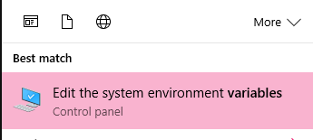
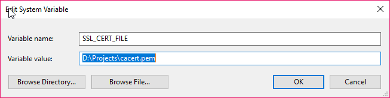
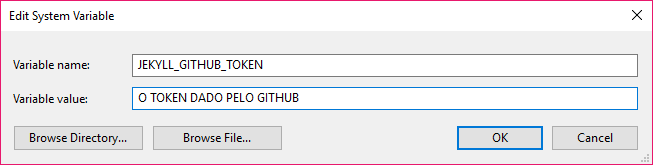

Não consegui achar uma ferramenta de blog que tivesse um editor de Markdown competente. Ambos [Wordpress](https://wordpress.com) e [Tumblr](https://tumblr.com) prometem a ferramenta, mas apresentam de forma super pobre. [Como já disse antes]() eu entendo que o público alvo desses sites são muito amplos para atender esse tipo de especificação, então eu achei melhor mudar de vez de ferramenta.

<!--more-->

Eu já havia flertado com o [Jekyll](https://jekyllrb.com/) antes, mas achava muito complicado, sem sequer testar. Eu fiquei positivamente surpreso ao descobrir o quão fácil é fazê-lo funcionar. Eu tive uns problemas por usar Windows, mas isso eu já esperava.

O guia no site do Jekyll é bem simples de usar. Eu instalei o ruby via [Chocolatey](https://chocolatey.org/) e o resto foi bem simples, apesar de trabalhoso.

O mais chato foi ter que adicionar variáveis de sistema no Windows, algo que nunca precisei, mas que é necessário para que o certificado SSL não dê erros. Peguei um certificado [daqui](https://curl.haxx.se/ca/cacert.pem) e coloquei como variável do sistema. Também [gerei um token](https://github.com/settings/tokens/new) pro Jekyll no github.

Além disso, tive que instalar o [Ruby Dev Kit](https://rubyinstaller.org/downloads/) e fazê-lo funcionar com o Ruby da máquina, o que pareceu complicado, mas não foi nada de outro mundo - basta fazer rodá-lo com o path da máquina.

Para melhorar o visual do blog eu também fiz várias alterações no tema padrão [minima](https://github.com/jekyll/minima), colocando alguns extras do tema [Kiko Plus](https://aweekj.github.io/Kiko-plus/).

Tenho agora um blog mais completo, que posso escrever diretamente no [Sublime](https://www.sublimetext.com/3) ou qualquer outro editor, como o [Visual Studio Code](https://code.visualstudio.com), que tenho usado bastante. E o melhor, com Markdown completo, com block de código colorido e sem frescura. Também tenho o poder de colocar imagens no [Puush](https://puush.me) como já estava fazendo e comentários com o [Disqus](https://disqus.com).

O último passo será colocar o [Google AMP](https://www.ampproject.org) e fazer deploy do site no Github apenas do site publicado e não com o source todo. Esses eu planejo fazer mais pra frente, já que o AMP é super limitado e o deploy no Github tirar parte da praticidade de só escrever documentos no Jekyll.
