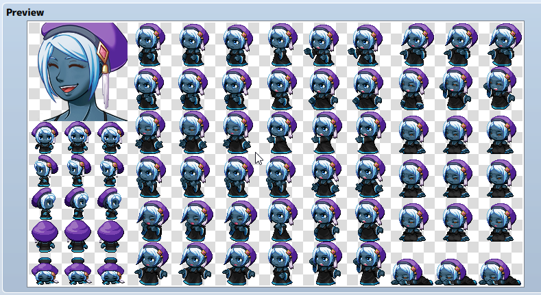

Como prometido, vou falar um pouco sobre os personagens do jogo e também das raças que os acompanham. Como é muita informação, vou começar com a personagem principal. Os outros vão vindo conforme consigo escrever. É possível também que eu atualize esse post no futuro ou coloque como artigo ao invés de post, já que é uma informação em constante mudança. Vamos lá!

<!--more-->

## Lumi

Personagem principal, claro, já que o jogo leva seu nome. É da raça Noctilla, que tem algumas características bem marcantes descritas mais pra frente no texto. É mulher e princesa do Reino Noctilla, que fica ao norte da Floresta do Labirinto, numa espécie de ilha flutuante. Tem uma aparência bem jovem, similar a uma humana de 18 anos. Tem os cabelos azulados, estatura e peso medianos. Sua roupa principal é um vestido preto e uma boina roxa - essa última representa sua formação nas artes arcanas Noctilla. Apesar do título, é um tanto modesta. Quando criança adorava viajar para o vilarejo Flokis próximo, onde brincava com os amigos Saulo e Silvana. Essa influencia a fez gostar muito de música, apesar de não ter nenhum talento nesse sentido. Estudou muito as artes de seu povo e pratica magia Noctilla de forma espontânea. Como símbolo de seus poderes, empunha Cetros e Cajados. Seu pai é o rei Antonio e sua mãe, rainha Valentina. No começo do jogo são introduzidos brevemente.

Apesar de única, parte das características da raça ajudam a explicar bastante sobre a personagem:

### Noctilla: Aparência

Eles tem uma cor de pele bem escura e próxima do preto, variando em nuances quase imperceptíveis de azul, verde e vermelho. O cabelo é branco, radiante, com nuances brilhantes que seguem o tom da pele. Não se sabe ao certo a expectativa de vida, mas se sabe que é pelo menos o dobro dos humanos. Tem a altura de um humano comum, com a diferença que os homens tem a mesma massa muscular e estatura das mulheres. Sua pele tem uma textura dura e na velhice não aparentam muitas rugas.

### Noctilla: Social & Cultura

Dizem que eles não dormem à noite, preferindo dormir várias vezes em poucos minutos ao dia, o que na soma não passa de 3 horas em média. Podem dormir de pé e falando, o que gera uma certa estranheza social para outras raças. Não possuem o hábito de ter camas, apesar de existir em certos lares e no castelo. Meditam quase sempre, mesmo quando em conflito, tentando achar pontos de vista diferentes, agindo em concordância com a maioria. Estudam os lados positivos e negativos em diversas situações e levam isso como filosofia de vida. Apesar dessa inclinação à diplomacia, sua cidade principal é governada como uma monarquia. Para eles é importante ter um sistema de governo diferente do que os outros povos possuem, já que Halidom tem um regime de parlamento. Eles tem muitas tradições contraditórias e as levam muito a sério. Seu povo só existe em um reino, que não é muito grande ou expressivo. Dizem que seus poderes aumentam quanto mais próximos do sol e da lua, por isso estarem numa ilha flutuante distante verticalmente do continente. Socialmente, passam a imagem de se darem bem com todos os povos, porém só vivem entre si, o que fazem os outros acharem isso uma falsidade enorme. Não se aliaram oficialmente a nenhum povo e nunca participaram das guerras, preferindo observar de longe. Esse comportamento os faz não terem representação oficial em Halidom, estando junto com os Apex, denominação dada a um conjunto de raças menores dos reinos. Consideram as Harpias como inimigos naturais, porém não incitam conflitos. Tem um ótimo relacionamento com os Flokis do vilarejo mais próximo do reino, porém não oficializam a aliança por não acreditarem que todos os Flokis se comportam da mesma maneira.

### Noctilla: Poderes

É sabido que seus poderes advém tanto da Luz quanto da Sombra, manipulando as energias arcanas dentro desse espectro de acordo com seu humor e vontade. Os poderes geralmente tem duplo sentido, dependendo do seu alvo e de como o Noctilla quer o resultado. Fisicamente não são muito expressivos, exceto pela resistencia natural aos elementos e à escola do tempo-espaço. Portanto, seu exército tem uma força bruta relativamente mais frágil que a humana, com a diferença dos poucos manipuladores arcanos que existem.

### Curiosidade

O nome Noctilla veio do latim: _Noct_ significa noite, _Illa_ significa dia. Devido à dualidade da raça e seus conceitos extremos, fui buscar algo que tivesse bem a ver e caiu como uma luva!
