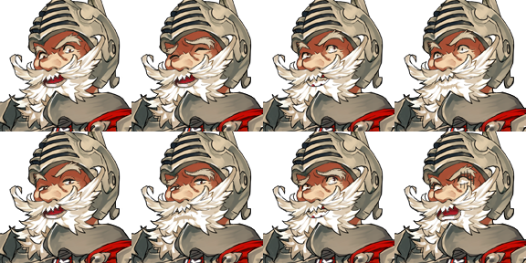
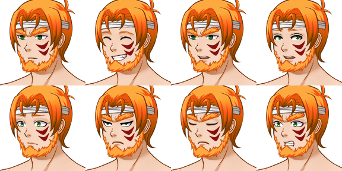
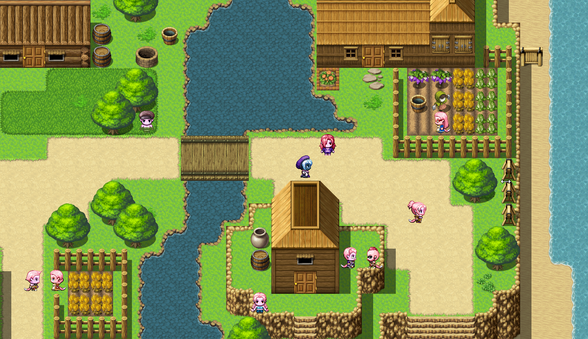
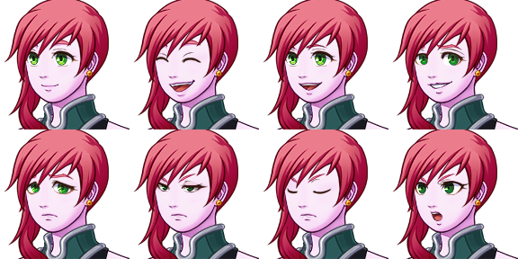
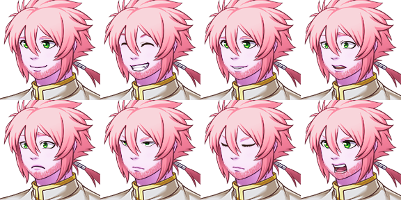
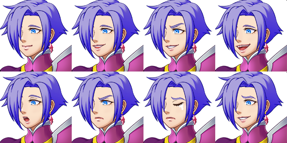
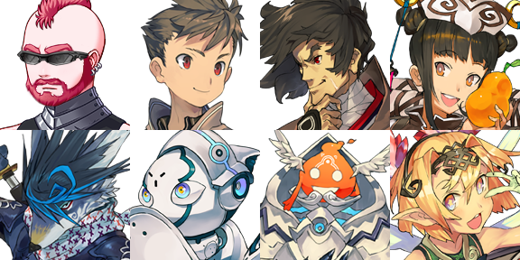

Chegou a hora de apresentar mais personagens :tada:. Alvaro, um humano que deve ajudar a Lumi logo no início de sua grande cruzada. Saulo e Silvana, dois Flokis do vilarejo próximo, que brincavam com Lumi na sua infância. Vitoria, uma elfa guerreira mística muito animada. E vários outros: Flávio, Carlos, Yashiro, Kasumi, Polum, Bauro, Teco, Mobi e Mara. Está preparado?

<!--more-->

## Alvaro

Um humano guerreiro com cara de poucos amigos. É introduzido na história bem no comecinho na Floresta do Labirinto. Tem barba e cabelos brancos, olhos pretos e uma armadura completa com capa e tudo. Tem um comportamento justo e ríspido, que pode ser confundido por brutalidade e mau humor. Apesar de estar próximo dos 50 anos, tem muita força e poder defensivo. Sua cidade natal é Nori, a principal (e única) cidade humana. Foi representante do seu povo em diversos conflitos e parece dever favores aos Noctilla.

[Como mencionei em um post](), ele terá um poder de transformar-se em uma figura passada, mais jovem e mais poderoso ainda - e nessa forma, ele irá profanar um montão de palavrões :boom: auto-censurados. Gostaria de sujestões aqui... eu pensei em alguns, mas não estão tão bons. Quanto mais tempo passar o jogo, mais dessa antiga forma ele irá lembrar e, talvez, misture suas ações.

### Curiosidade

Ele já teve o nome de Zero e Antonio antes de ser Alvaro, porém ele tinha uma aparência bastante diferente. Era ruivo de olhos verdes, com uma faixa na cabeça e uma tatuagem vermelha no rosto que representava sua tribo. O comportamento era igual, mas era muito mais jovem e mais bárbaro que guerreiro. O motivo da mudança é que queria alguém com uma figura mais paterna próximo da Lumi e, como grande parte do jogo também é sobre diversidade, uma pessoa mais velha faz toda a diferença. É possível que eu ainda use seus sprites antigos para outro personagem ou que Zero ressurja como um vilão. Veremos em cenas do próximo ~~episódio~~ post.

## Raça: Flokis

Antes de falar da Silvana e do Saulo, resolvi resumir um pouco sobre a raça deles, já que serve para os dois.

São humanóides rosados com rabo de raposa. Seus cabelos seguem o padrão rosado, só mudam na intensidade. Dizem que sua coloração vem de sua alimentação, como os flamingos. Geralmente vivem em tribos próximos a lagos e cachoeiras. Praticamente todas as tribos compõem uma canção tradicional dela, já que são muito ligados em música :musical_note:.

É a única raça que possui representatividade em Halidom que não tem uma cidade principal. Os humores, tradições, alianças e até parte da sua coloração variam conforme a região e é o motivo principal de viverem em pequenas tribos. Costumam dormir por pelo menos 10 horas por dia. A grande maioria das tribos formam alianças ou pactos pacíficos com os elfos locais - alguns por medo e sobrevivencia, outros por compartilharem a filosofia de defesa da natureza.

## Silvana

De um temperamento mandão, Silvana gosta das coisas do jeito dela. Apesar disso, é doce e divertida com quem gosta. Ela sente uma grande atração pela Lumi, o que faz seu lado mais doce ser mais notório em diálogos com ela. É possível que surja um romance :revolving_hearts:. Prefere calças a saias e vestidos, é magrela e de estatura mediana. Seus cabelos são mais escuros que o habitual Flokis e seus olhos são verdes. Ela luta com chicote (YAS KWEEN!) e é super ágil! Talvez tenha poderes ladinos (vulgo roubo).

## Saulo

Saulo é um curandeiro zen. É cauteloso e tranquilo, ama a natureza :herb: mais que o normal, beirando o típico hippie. Protege sua irmã a todo custo. Usa eufemismos para suavizar cenas tóxicas e tenta evitar conflitos. Tem um cabelo desleixado e barba por fazer. Assim como sua irmã, seus olhos são verdes e é uns 10cm mais baixo e mais gordinho. Seus poderes são principalmente de cura e melhorias (buffs). Para o combate, ele prefere armas não cortantes, como maças, porretes e cetros e, mais tarde, apenas luvas. Em algum momento do jogo, Saulo poderá se transformar em uma raposa, trocando seus poderes curandeiros em poderes de combate corpo a corpo, uma máquina de matar!

## Raça: Elfos

Do mesmo jeito que fiz com os Flokis: primeiro a raça, depois o personagem, nesse caso, Vitoria.

Humanóides, com características que mudam dependendo do lugar onde vivem. Elfos vivem em praticamente qualquer lugar com natureza abundante e suas características são misturadas ao ambiente.

Um Elfo da floresta geralmente é esverdeado, com tons de árvores, folhas e até parte insetos; da mesma forma, elfos das montanhas contém traços da montanha em sua pele, são mais fortes e rijos e acostumados com o ar rarefeito. Elfos das cavernas tem tons de pele e cabelos escuros, com visão aperfeiçoada para a escuridão, com poderes mágicos aguçados que dizem vir de cristais arcaicos, dos quais ainda preservam. Menos conhecidos são os Elfos polares, arquipélagos e dos desertos.

São extremamente ligados à natureza e creem que nasceram dela de forma espontânea para ajudá-la e fortalecê-la. Desprezam os que a consomem de forma imprópria e inclusive combatem quem a fizer. São criaturas muito habilidosas em combate e magia - se atacados em seu lar, são ainda mais letais.

## Vitoria

Diferente dos Elfos comuns <small>(por que expliquei os elfos antes então?)</small> :facepunch:, Vitoria não tem muitos traços de seu povo. Isso porque ela nasceu na cidade de Halidom, no meio da Guerra da Invasão. Por não ter a forte influencia da natureza, ela não tem os traços comuns dos elfos, parecendo muito uma humana comum - o que traz muita confusão quando vista por um. O que a faz mais diferente ainda são seus cabelos azuis. Outros elfos não a entendem e outras raças a consideram uma espécie de anomalia, exceto em Halidom, que é um lugar onde diversidade é o comum. Ela é faladeira e muito animada, preferindo agir ao invés de falar. Aprendeu sobre combate e magia sozinha e acabou sendo tão boa que foi chamada para a guarda de Halidom, onde aprendeu mais sobre como ser uma guerreira. Usa apenas uma espada como arma principal na mão esquerda e na direita usa magias ilusórias para confundir os inimigos. Mais pra frente na história ela revela um lado negro desconcertante.

## Outros personagens

Existem outros personagens mais secundários na história que ainda não tenho muito sobre, são apenas ideias por enquanto. Na ordem da imagem, são eles:

- Flávio: chefe da guarda Flokis do vilarejo de Saulo e Silvana, um tanto estilosão, parece q os membros do Village People explodiram nele;
- Carlos: um garoto meio chato, meio sexualizado demais pra sua idade e que só cria desconforto à Lumi, mas que acaba ajudando muito a todos;
- Yashiro & Kasumi: são humanos orientais, um casal que vive distante dos humanos numa ilha no meio do oceano. Kasumi é viciada numa fruta que parece uma pêra e Yashiro é o ser mais analítico do mundo;
- Bauro: forma humanóide de raposa (er... difícil descrever) do Saulo;
- Teco: um dos vários robôs sentinelas, aquele que conseguiu criar a própria consciência;
- Mobi: demônio engenheiro de asas, construiu os sentinelas e essa máquina que chama de Mobi;
- Mara: fada do povo miúdo (pixie) que participa contra sua vontade de experimentos de laboratório, fazendo-a ficar maior e desproporcional às suas asas.
- Polum: (não está na imagem) aquele que acreditava que seria o príncipe Noctilla, irá atrás de Lumi por algum tempo;

### Devaneios

Eu já gosto deles todos. Tenho vontade de enfiar mais 200 pessoas no meio disso, por isso tenho que me controlar. Vai ser divertido colocar eles todos na história, com certeza :stuck_out_tongue_closed_eyes:!

Estou pensando em fazer um post sobre os mapas de alguns lugares que já existem e o processo que foi montá-los. Não posso prometer data, mas será em breve. Até lá! :wave:
